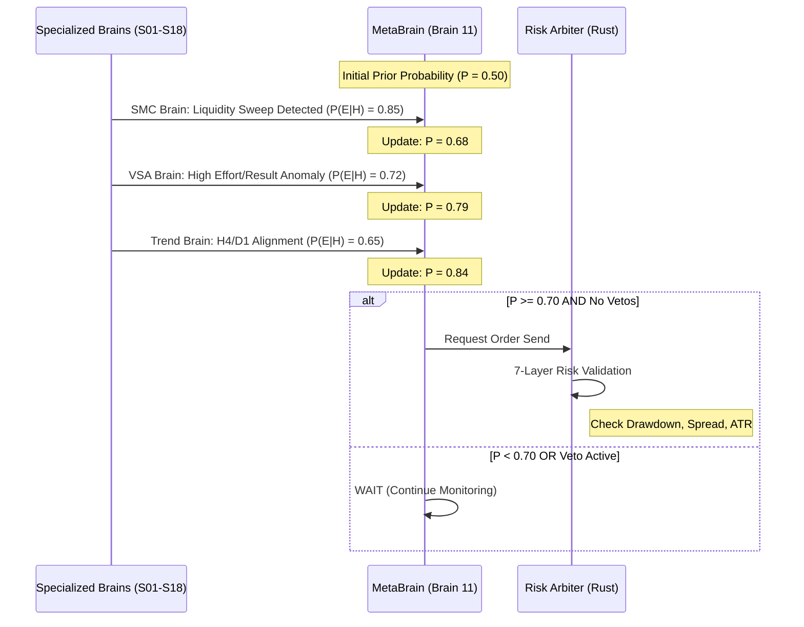

# 📊 AAT System Illustrations & Architecture

This document provides visual representations of the **Autonomous AutoTrader (AAT) V2.3.0-ASCENDANT** architecture and logic.

## 1. High-Level System Flow
The system operates as a distributed network between MetaTrader 5 and the Python Hive.

```mermaid
graph TD
    subgraph "MetaTrader 5 (Agents)"
        DC[AAT_DataCollector] -- "Real-time Ticks / MTF Bars" --> BS
        ME[AAT_MasterExecutor] <--- "TRADE_ACK / Execution" --- BS
    end

    subgraph "Python Hive (Intelligence)"
        BS[Bridge Server: TCP/Async] -- "JSON Payload" --> ORCH[Hive Orchestrator]
        ORCH -- "Stream: [Symbol]" --> BRAINS{Specialized Brains}
        BRAINS -- "P(E|H) Evidence" --> MB[MetaBrain: Bayesian Engine]
        MB -- "Consensus Signal" --> RM[Risk Manager]
        RM -- "Order Request" --> ORCH
        ORCH -- "Binary Payload" --> BS
    end

    subgraph "Persistence"
        RM -- "Audit Trail" --> DB[(SQLite: audit_records.db)]
    end
```

---

## 2. The "Phoenix Ascendant" CPU Layout
AAT utilizes a strict **20-process architecture**, pinning core components to specific logical processors to bypass the Python GIL and minimize latency.

```mermaid
grid-layout
    title CPU Affinity (20 Logical Processors)

    CPU_0[Supervisor / Watchdog]
    CPU_1[Hive Orchestrator]

    CPU_2[Market Data A]
    CPU_3[Market Data B]

    CPU_4[Indicator Analyst]
    CPU_5[SMC Analyst]
    CPU_6[VSA Analyst]

    CPU_7[Trend Brain]
    CPU_8[Liquidity Brain]
    CPU_9[Regime Brain]

    CPU_10[Anomaly Brain]
    CPU_11[MetaBrain: Bayesian]
    CPU_12[Monitoring Brain]

    CPU_13[News/Risk Brain]
    CPU_14[Contrarian Brain]

    CPU_15[Risk Manager A]
    CPU_16[Risk Manager B]

    CPU_17[Execution A]
    CPU_18[Execution B]

    CPU_19[Memory/Learning Brain]
```

---

## 3. Bayesian MetaBrain Decision Logic
The MetaBrain acts as a sequential probability updater, calculating the likelihood of trade success based on evidence from specialized worker brains.


